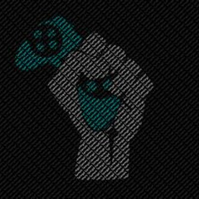

# AFK: Always for Komrads
___  

### Integrantes:
- Betsy Vidal
- Franshesca Quezada

___  

## Objetivo:  

- El objetivo de esta red social es unir a los amantes de los diversos videojuegos que hay en el mercado en un solo lugar, dado que diversos equipos solo pueden dar su opinion por forums o blogs. Además, si eres un principiante y no tienes contactos ni conocidos del mundo gamer, entonces esta plataforma es para tí!  

___

## UX: 

- Se entrevisto a diferentes Gamers y se les pregunto sus necesidades, el tipo de estilos y colores que mas les atrae para este tipo de plataforma.

___

## Flujo de la aplicación

- Vista splash con duración de 2 a 5 segundos que redirecciona a tu vista de inicio. 
- La vista de inicio cuenta con dos botones, __LOG IN__ para que el usuario pueda entrar a su cuenta y  __SIGN UP__ para el registro en caso de no tener cuenta.  
- En la vista __SIGN UP__ el usuario debe registrar su información personal, el cual queda guardado en la base local y __LOG IN__ tenemos 2 inputs donde ya puede entrar a su cuenta.
- El Usuario ingresara a una vista filtrada donde tendra que escoger a que '**raza**' de gamer pertenece: **console, pc o mobile**
- Una vez que haya escogido su **raza**, el obtendra su perfil personal donde puede subir fotos Y/O videos, una sección donde puede ver sus noticias, y por ultimo chatear con gente que hace un '__match__'. *Esto esta en el Navbar representado por iconos.
- EL usuario puede subir fotos y videos que pueden ser visualizados __solo__ por 24 hrs; Esto se denomina la jugada del día y sera representado con un Modal.
- Una vez cerrado el modal vuelve a la vista principal.
- Cuando desees salir de tu cuenta, el usuario tendra que ir al menu hamburguesa donde estara la opción 'cerrar sesión' y esto le enviara al la página de registro.

___

## Flujo de trabajo:

- Primero creamos la estructura HTML, en forma anidada.
- Comentar el código.
- Enlazamos el archivo externo del CSS, esto para un mayor orden y hacer uso de las buenas practicas.
- Enlazamos los archivos descargados, para hacer uso de las herramientas de Bootstrap.
- Enlazamos los archivos descargados, para hacer uso de los selectores de Jquery.
- Luego continuamos trabajando en CSS.
- Comentar el código.
- Subimos avances a github.
- Terminar de dar estilo con CSS.
- Empezamos a trabajar en JS utilizando Jquery, para dar interacción a la página.
- Comentar el código.
- Subimos avances a github.
- Cumplimos con el objetivo.
- Digitar el archivo README.md
- Subir el producto final a github.
- Crear la rama "gh-pages".

___

## Herramientas Utilizadas:

- Html, para la estructura del contenido.
- Css, para darle estilo al contenido.
- Bootstrap
- Jquery

___

## Fuente consultada:

- [Laboratoria LMS] : https://lms.laboratoria.la/cohorts/lim-2017-09-bc-core-pm/courses/social-network/02-jquery/01-jQuery

- [Bootstrap] : https://getbootstrap.com/docs/3.3/css/#forms

- [W3School] : https://www.w3schools.com/bootstrap/bootstrap_forms.asp

- [Jquery] : 
https://oscarotero.com/jquery/

___

## Vistas Principales: 

- Vista Splash:

